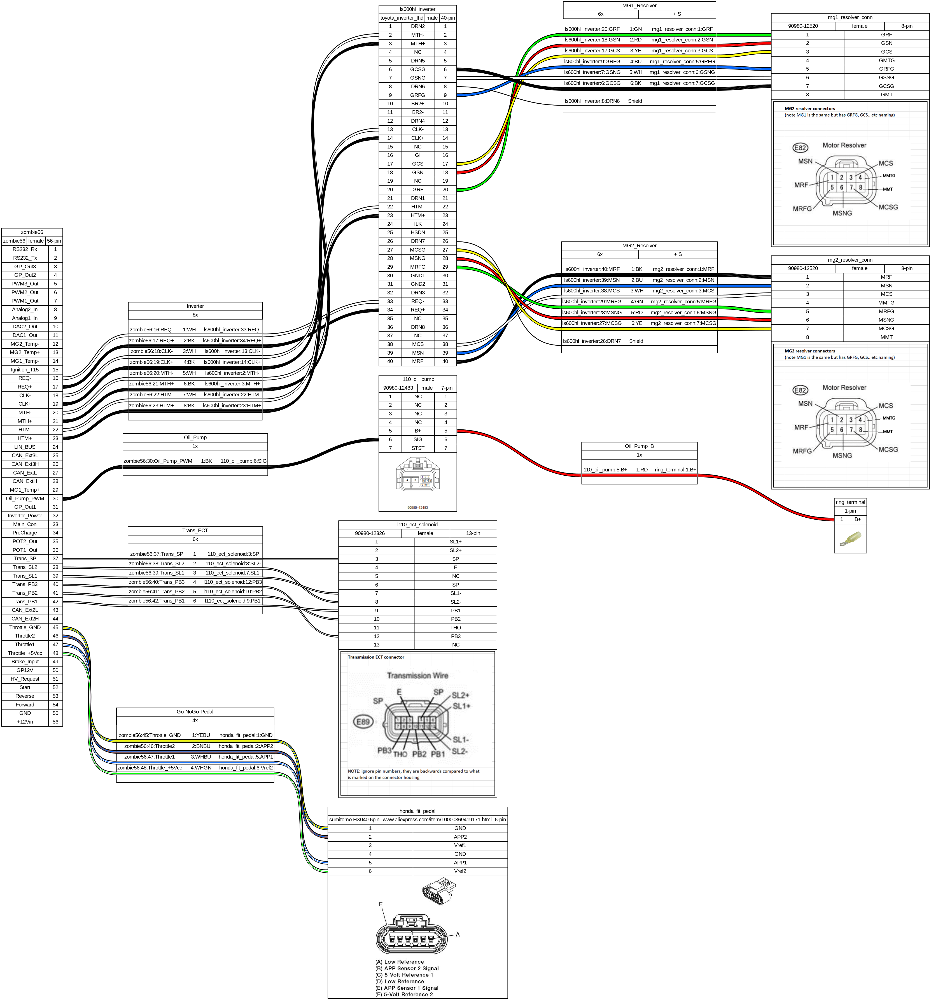

# GS450H/LS600HL - Zombie VCU wiring

Much of this information came from https://openinverter.org/wiki/Main_Page and indeed, many of the connector images all originate from that Wiki.

## Building.

In order to modularize this a bit with an eye to re-use by the community (hopefully),  and because YAML doesn't know about 'include' files, I've chosen to use the C-preprocessor and GnuMake. You will need a Linux system (or Windows WSL) to build it.  

You will also need to install Wireviz/Graphviz.

Instructions on how to do so are out of the scope of this document.

## Notes

## Output

